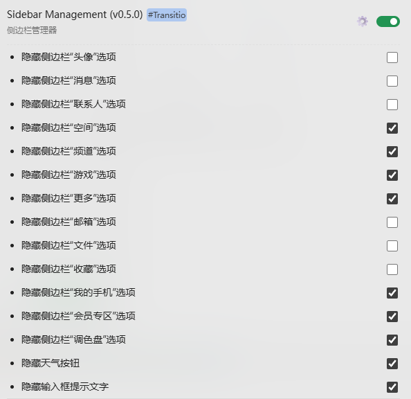

**适用于 [Transitio](https://github.com/PRO-2684/transitio) 插件的QQNT自定义样式**

## 以下用户样式均为自用 ##

## [sidebar-management](./sidebar-management.css)

复刻自[sidebar-management](https://github.com/YF-Eternal/Sidebar-Management)，可设置左边侧边栏的所有选项是否需要隐藏。

## [ConversationQuickRemover](./ConversationQuickRemover.js)

复刻自[ConversationQuickRemover.js](https://github.com/Natsukage/Scriptio-user-scripts)，快捷移除对话

## [highlight-at](./highlight-at.css)

高亮艾特

## [hide-self](./hide-self.css)

隐藏居右的自己的头像和昵称（兼容 lite-tools）
